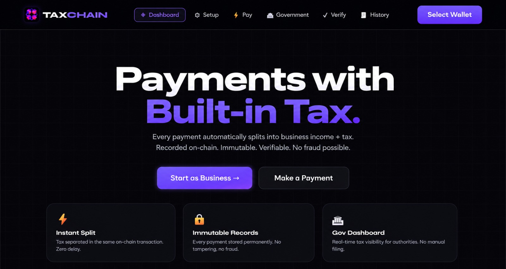

<div align="center">


# TaxChain

### Automatic Tax Collection on Solana Blockchain

**Every payment automatically splits into business income + tax.**
**Recorded on-chain. Immutable. Verifiable. No fraud possible.**

[](https://solana.com)
[](https://anchor-lang.com)
[](https://react.dev)
[](https://typescriptlang.org)

[Smart Contract](#smart-contract) · [Setup](#setup) · [Team](#team)

</div>

---



---

## The Problem

Tax evasion costs governments billions every year.
Current system relies on:
- Manual tax filing (error-prone, gameable)
- Trust in businesses to report correctly
- Slow audit cycles that miss real-time fraud
- Paper receipts that can be faked

**TaxChain eliminates all of this.**

---

## Our Solution

TaxChain is a **GovTech DApp on Solana** that automates tax collection
at the payment layer using smart contracts.

```
Customer pays ₹1130
       ↓
Smart Contract executes instantly
       ↓
₹1000 → Business Wallet  ✅
 ₹130 → Government Wallet ✅
       ↓
Immutable TaxRecord created on blockchain
       ↓
NFT Receipt minted to customer Phantom wallet
```

**No middleman. No manual filing. No fraud possible.**

---

## Key Features

| Feature | Description |
|---|---|
| ⚡ **Instant Tax Split** | Every payment splits automatically in one blockchain transaction |
| 🔒 **Immutable Records** | TaxRecord PDAs stored permanently on Solana — cannot be altered |
| 🏛 **Government Portal** | Real-time tax dashboard — auto-detected when gov wallet connects |
| 🧾 **NFT Receipts** | Every payment mints an NFT receipt to the customer's Phantom wallet |
| 📱 **QR Code Payments** | Customers scan QR code with Phantom app — smart contract runs automatically |
| 🔍 **Public Verification** | Anyone can verify any payment using business wallet + transaction index |
| 📊 **Analytics Dashboard** | Revenue vs tax charts, full transaction history |
| ⬇ **CSV Export** | Government can export all tax records as spreadsheet |

---

## How It Works

### Step 1 — Business Registers (One Time)
Business owner connects Phantom wallet and registers on-chain:
- Business name
- Tax rate (e.g. 13% Nepal VAT)
- Government wallet address (tax authority)

A **BusinessAccount PDA** is created permanently on Solana.

### Step 2 — Customer Pays
Customer scans QR code or pays directly via the app.
The smart contract:
1. Receives total payment (e.g. 0.01 SOL)
2. Calculates split using tax-inclusive formula
3. Sends net amount → business wallet
4. Sends tax amount → government wallet
5. Creates immutable **TaxRecord PDA**
6. Mints **NFT receipt** to customer wallet

All in **one transaction**.

### Step 3 — Government Views in Real Time
Government connects their Phantom wallet to the portal.
The system **automatically detects** the government wallet and shows:
- All businesses that registered this wallet as tax authority
- Real-time tax collection amounts
- Full transaction history with search and filter
- CSV export for reports

### Step 4 — Anyone Can Verify
Enter any business wallet address + transaction index:
- See full payment details
- Confirm tax was paid
- View on Solana Explorer
- Cannot be faked — data is on-chain

---

## Tax Formula

```
Tax = Total × TaxRate / (10000 + TaxRate)

Example at 13% (1300 bps):
  Total  = 1130 lamports
  Tax    = 1130 × 1300 / (10000 + 1300) = 130 lamports ✅
  Net    = 1130 - 130 = 1000 lamports ✅
```

This tax-inclusive formula ensures:
- Customer always pays exactly the stated total
- Business + government always receive the correct split
- Zero rounding errors

---

## Smart Contract

**Program ID:** `7rCpefks9mQwx9TLnuNbjV6j4dSDYpFpBg6tNw6TJ4Yp`
**Network:** Solana Devnet
**Framework:** Anchor 0.30.1

### Instructions

| Instruction | Description | Who Signs |
|---|---|---|
| `initialize_business` | Register business on-chain | Business owner |
| `pay_with_tax` | Process payment with auto tax split | Customer (payer) |
| `update_tax_rate` | Change tax rate | Business owner only |
| `update_government_wallet` | Change tax authority wallet | Business owner only |

### On-Chain Account Types

**BusinessAccount PDA**
```
Seeds: ["business", owner_wallet]

Stores:
├── owner wallet
├── government wallet
├── business name
├── tax rate (bps)
├── total revenue
├── total tax collected
└── transaction count
```

**TaxRecord PDA** (one per payment — immutable)
```
Seeds: ["tax_record", businessPDA, transaction_index]

Stores:
├── business PDA
├── payer wallet
├── business owner wallet
├── government wallet
├── total amount
├── tax amount
├── net amount
├── tax rate applied
├── product name
├── invoice IPFS hash
└── timestamp
```

---

## NFT Receipts

Every payment mints an NFT to the customer's Phantom wallet using **Metaplex**.

```
NFT Metadata:
├── Name:    "TaxChain Receipt #0001"
├── Symbol:  "TXRCPT"
├── Image:   Receipt card (IPFS)
└── Attributes:
    ├── Business:       "Momo Palace"
    ├── Product:        "Momo Set"
    ├── Total Paid:     "0.010000 SOL"
    ├── Tax Collected:  "0.001150 SOL"
    ├── Net to Business:"0.008850 SOL"
    ├── Tax Rate:       "13%"
    ├── Date:           "2024-01-01"
    ├── TxRecord PDA:   "ABC...XYZ"
    ├── Verified:       "true"
    └── Network:        "Solana Devnet"
```

NFT properties:
- `isMutable: false` — cannot be altered after minting
- Metadata stored on IPFS via Pinata
- Visible in Phantom wallet → Collectibles tab

---

## Architecture

```
┌──────────────────────────────────────────────────┐
│           FRONTEND (React + Vite)                │
│                                                  │
│  Business App          Government Portal         │
│  localhost:5173        (auto-detected by wallet) │
│                                                  │
│  ├── Dashboard         ├── Real-time feed        │
│  ├── Business Setup    ├── Business filter chips │
│  ├── Payment + QR      ├── Wallet search         │
│  ├── NFT Receipt       ├── Sort controls         │
│  └── Verify            └── CSV export            │
└──────────────────┬───────────────────────────────┘
                   │ @coral-xyz/anchor
                   │ @solana/web3.js
                   │ @metaplex-foundation/umi
                   ↓
┌──────────────────────────────────────────────────┐
│         SMART CONTRACT (Rust + Anchor)           │
│                                                  │
│  initialize_business()                           │
│  pay_with_tax()         ← core logic             │
│  update_tax_rate()                               │
│  update_government_wallet()                      │
└──────────────────┬───────────────────────────────┘
                   ↓
┌─────────────────────────────────────────────────┐
│           SOLANA BLOCKCHAIN (Devnet)            │
│                                                 │
│  BusinessAccount PDAs  ← business registry      │
│  TaxRecord PDAs        ← immutable payment log  │
│  NFT Mints             ← customer receipts      │
└─────────────────────────────────────────────────┘
                   +
┌─────────────────────────────────────────────────┐
│           IPFS (Pinata)                         │
│  NFT metadata JSON     ← receipt details        │
└─────────────────────────────────────────────────┘
```

---

## Tech Stack

| Layer | Technology |
|---|---|
| Blockchain | Solana (Devnet) |
| Smart Contract Language | Rust |
| Smart Contract Framework | Anchor 0.30.1 |
| Frontend | React 18 + Vite + TypeScript |
| Wallet | Phantom (via @solana/wallet-adapter) |
| Blockchain Client | @coral-xyz/anchor + @solana/web3.js |
| NFT | Metaplex (mpl-token-metadata) |
| NFT Storage | IPFS via Pinata |
| Charts | Recharts |
| QR Code | qrcode.react |

---

## Project Structure

```
taxchain/
├── taxpay/                        ← Anchor smart contract
│   ├── programs/taxpay/src/
│   │   └── lib.rs                 ← Smart contract (all logic)
│   ├── tests/
│   │   └── taxpay.ts              ← Integration tests
│   └── Anchor.toml
│
├── taxpay-vite/                   ← React frontend
│   └── src/
│       ├── App.tsx                ← Root + wallet provider + auto-detect gov
│       ├── components/
│       │   ├── Dashboard.tsx      ← Business dashboard + landing page
│       │   ├── BusinessSetup.tsx  ← Register business on-chain
│       │   ├── PaymentForm.tsx    ← Pay + QR + NFT receipt
│       │   ├── GovPortal.tsx      ← Government tax portal
│       │   ├── GovernmentDashboard.tsx
│       │   ├── PaymentVerifier.tsx
│       │   └── Header.tsx
│       ├── hooks/
│       │   └── useProgram.ts      ← All blockchain calls
│       └── utils/
│           ├── constants.ts       ← Config + helpers
│           └── nftReceipt.ts      ← NFT minting utility
│
└── server/
    └── index.js                   ← QR payment relay server
```

---

## Setup

### Prerequisites

```bash
# Rust
curl --proto '=https' --tlsv1.2 -sSf https://sh.rustup.rs | sh

# Solana CLI
sh -c "$(curl -sSfL https://release.solana.com/v1.18.12/install)"

# Anchor CLI
cargo install --git https://github.com/coral-xyz/anchor avm --locked
avm install 0.30.1 && avm use 0.30.1

# Node.js 18+
nvm install 18 && nvm use 18
```

### Deploy Smart Contract

```bash
# Setup wallet
solana-keygen new --outfile ~/.config/solana/id.json
solana config set --url devnet
solana airdrop 5

# Build and deploy
cd taxpay
yarn install
anchor build
anchor deploy --provider.cluster devnet

# Copy IDL to frontend
cp target/idl/taxpay.json ../taxpay-vite/src/idl/taxpay.json
```

### Run Frontend

```bash
cd taxpay-vite
npm install

# Add to .env:
# VITE_PINATA_JWT=your_pinata_jwt_here

npm run dev
# → http://localhost:5173
```

### Run Tests

```bash
cd taxpay
anchor test --provider.cluster devnet
```

---

### Business Side
```
1. Open localhost:5173
2. Connect business Phantom wallet
3. Click Setup → Register business
   - Name: "Momo Palace"
   - Tax Rate: 13%
   - Gov Wallet: [paste government wallet]
4. Click Pay → Create Invoice
   - Product: "Special Momo Set"
   - Amount: 0.01 SOL
   - QR code generated → customer scans
   OR click Pay button directly
5. Phantom popup → Approve
6. See:  Payment split +  NFT Receipt minted
```

### Government Side
```
1. Switch Phantom to government wallet
2. App automatically shows Government Portal
3. See all businesses + tax collected in real time
4. Click "▶ Go Live" → new payments appear automatically
5. Filter by business chip or wallet address
6. Export CSV for records
```

### Verification
```
1. Click Verify tab
2. Enter: business wallet + transaction index (0, 1, 2...)
3. See full on-chain payment record
4. Click View on Solana Explorer
```

---

## What Makes TaxChain Unique

### vs Traditional Tax Systems
```
Traditional:
  Business collects tax → deposits to govt account → files returns
  Problem: delay, evasion, human error, fraud

TaxChain:
  Smart contract splits instantly → immutable record created
  No delay, no evasion possible, no human error, no fraud
```

### vs Other Blockchain Payment Apps
```
Other apps: just process payments on blockchain

TaxChain: builds tax compliance INTO the payment protocol
  → Tax is not optional, it's enforced by code
  → Government gets paid at the moment of transaction
  → Zero trust required from any party
```

### Dual-Wallet Architecture
```
Business wallet → business dashboard
Government wallet → automatic redirect to gov portal
No manual URL changes needed
System detects who you are by your wallet
```

---

## Data Storage

**No database. No server. 100% on-chain.**

| Data | Storage Location |
|---|---|
| Business info | Solana BusinessAccount PDA |
| Every payment | Solana TaxRecord PDA (immutable) |
| NFT receipts | Solana Token Account |
| NFT metadata | IPFS via Pinata |

All data is:
- **Permanent** — cannot be deleted
- **Immutable** — cannot be altered
- **Public** — anyone can verify
- **Decentralized** — no single point of failure

---

## Security

- Smart contract enforces tax split — cannot be bypassed
- `has_one` constraints verify account ownership on-chain
- Business owner cannot sign customer payments (removed from PayWithTax)
- TaxRecord PDAs are write-once — immutable after creation
- Government portal only shows businesses registered to that wallet
- NFT receipts marked `isMutable: false`

---

## Future Roadmap

- [ ] Multi-currency support (USDC, USDT)
- [ ] AES-256 encryption for sensitive product names
- [ ] Zero-knowledge proofs for private tax compliance
- [ ] Multiple tax rates per product category
- [ ] Mainnet deployment
- [ ] Integration with national tax authority APIs
- [ ] Automated monthly tax reports for government

---

## Team

Built at **Solana Nepal Hackathon 2026** by:

| Name | Role |
|---|---|
| **Krishna Roy** | Smart Contract + Backend |
| **Rishav Shrestha** | Frontend + Wallet Integration |
| **Swastika Timalasena** | UI/UX + Government Portal |

---

## License

MIT License — see [LICENSE](LICENSE) for details.

---

<div align="center">

**Built on Solana for automatic tax splitting**

*TaxChain — Where every payment is a tax receipt*

[](https://solana.com)

</div>